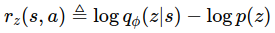

# DIAYN-PyTorch
   While intelligent  creatures can explore their environments and learn useful skills without supervision, many RL algorithms are heavily on the basis that acquiring skills is only achieved via defining them as explicit reward functions to learn.
    
   Thus, in order to translate the natural behavior of creatures in learning **diverse** skills to a suitable mathematical formulation, DIAYN (Diversity is All You Need) was proposed for learning useful skills **without any domain-specific reward function**.
    
   Instead of the real reward of the environment, DIAYN optimizes the following objective:

  

   that, _`z`_ is the skill that the agent is learning and, since, we desire learned skills to be **as diverse as possible**, _`z`_ is modelled by a Uniform random variable that has the highest standard variation.
    
   The above equation simply implies that the reward of any diverse task is equal to measuring how hard recognizing the skill _`z`_ is, given the state _`s`_ that the agent has visited compared to the real distribution over _`z`_ (which is Uniform distribution in DIAYN paper.)
The bigger  is, the more ambiguous skill _`z`_ is thus, the state _`s`_ should be visited more for task _`z`_ so, the agent finally acquire this skill.

   Concurrently to learn , any conventional RL method can be utilized to learn a policy and DIAYN uses SAC.

   This repository is a PyTorch implementation of Diversity is All You Need and SAC part of the code is based on [this repo](https://github.com/alirezakazemipour/SAC).
   
## Results